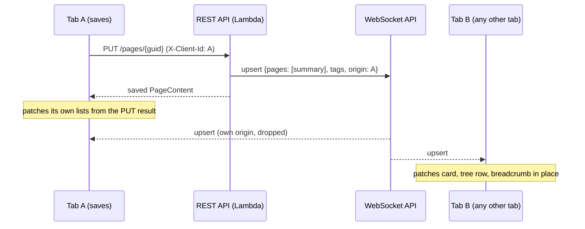

# BlueFinWiki

Purpose: a private, serverless family wiki with a built-in Kanban board system. See the root [README.md](README.md) for the full feature list, cost model, and getting-started steps.

## Tech stack

- Frontend: Angular 21 + Angular Material + TypeScript (see `frontend/SYSDOC.md`)
- Backend: AWS Lambda handlers, Node.js 20 + TypeScript, run locally via an Express wrapper (see `backend/SYSDOC.md`)
- Infrastructure: AWS CDK, C# (see `infrastructure/SYSDOC.md`)
- Local orchestration: Microsoft Aspire (see `aspire/SYSDOC.md`)
- E2E: Playwright (see `e2e/SYSDOC.md`)

## Where things are

- `frontend/` — Angular SPA. See `frontend/SYSDOC.md`.
- `backend/` — Lambda function handlers (auth, pages, storage, search, tags, page-types, MCP server). See `backend/SYSDOC.md`.
- `infrastructure/` — AWS CDK app (single Unified Stack). See `infrastructure/SYSDOC.md`.
- `aspire/` — local dev orchestration (AppHost). See `aspire/SYSDOC.md`.
- `e2e/` — Playwright suite against the running dev stack. See `e2e/SYSDOC.md`.
- `docs/flows/angular-parity-plan/` — project-plan docs for the React→Angular migration, not architecture docs.

## Realtime updates

Every write is pushed to every open tab over a WebSocket, so boards, the page tree and breadcrumbs update without a reload. It spans the backend and frontend, so the whole picture lives here.

Two message types, both carrying the writer's `origin` (the tab's `X-Client-Id`; `null` for API/MCP writes):

| Message | Sent for | Clients do |
|---|---|---|
| `upsert {pages, tags}` | Saving (or creating) a **published** page | Patch the page's list summary into boards / tree / breadcrumbs in place; refetch only the open page body (`page:<guid>`) and a parent list that lacks the page |
| `invalidate {tags}` | Everything else: draft, archived and deleted saves, moves, deletes, comments, attachments, page types, and any upsert over 96 KB | Refetch whatever the tags cover |

What is never broadcast: page `content`, and any data of a draft (drafts are visible only to their author). `backlinks:any` goes out only when a page's links actually change. A request that writes many pages (e.g. a reorder) sends one message for all of them.

Where it lives:

- Backend: `backend/src/realtime/` (publishing, the summary shape, the `ws-*` connection Lambdas, and `local-ws.ts` for local dev). Saves publish through `backend/src/storage/BroadcastingStoragePlugin.ts`.
- Frontend: `frontend/src/app/core/realtime/` (`realtime.ts` socket client, `page-upserts.ts` stream). The tag vocabulary is documented in `frontend/src/app/core/api/invalidation.ts`.
- Infrastructure: `RealtimeWsApi` and `RealtimeConnectionsTable` in `infrastructure/src/Infrastructure/Stacks/UnifiedStack.cs`.

Locally the backend serves the socket at `/ws` on port 3000, proxied by `ng serve` (`frontend/proxy.conf.json`). In production the frontend gets the WebSocket API URL from `NG_APP_REALTIME_URL` at build time; an empty value turns realtime off.

## Running it

Quickstart and deploy steps are in the root README and in `QUICKSTART.md` / `DEPLOY-AWS.md` — not repeated here.

One thing not spelled out elsewhere: the Aspire AppHost (`aspire/BlueFinWiki.AppHost/Program.cs`) is the single source of truth for how the whole local stack is wired together — it starts LocalStack, Cognito Local, and MailHog as containers, then launches `backend` (`npm run dev`, port 3000) and `frontend` (`npm start` → `ng serve`, port 5173) as JS apps via `AddJavaScriptApp`, wiring the frontend's `NG_APP_API_BASE_URL` to the backend's port and the backend's AWS/Cognito env vars to the emulated endpoints. There's no separate docker-compose or proxy config to hunt down — `Program.cs` is the whole picture, and `aspire/SYSDOC.md` covers the per-service detail.
