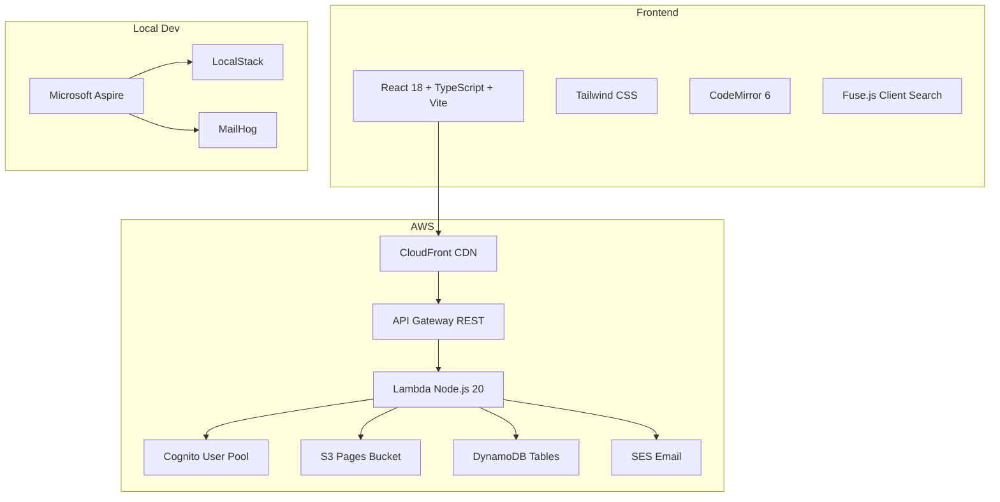

# BlueFinWiki Design

## Context

BlueFinWiki is a private family wiki for 3-20 members. It needs to be cheap (<$5/month), zero-ops, and reliable. The architecture must support a solo developer working with Claude as implementation partner — simplicity over sophistication at every decision point.

This design enables all flows: authentication, content editing, search, versioning, attachments, user management, and the features not yet built (comments, export, navigation, permissions).

## Constraints

- **Cost**: <$5/month total AWS bill for a family-sized wiki
- **Scale**: 3-20 users, <500 pages, <1000 attachments — not a platform
- **Ops**: Zero operational burden — no servers to maintain, no databases to tune
- **Team**: Solo developer + Claude — prefer managed services and simple abstractions
- **Local dev**: Must run entirely locally without AWS account for development

---

## Architecture Overview



### Frontend

React 18 with TypeScript, bundled by Vite, styled with Tailwind CSS. Served via CloudFront. Key libraries:
- **CodeMirror 6**: Markdown editor with syntax highlighting, toolbar, and split-pane preview
- **react-markdown**: Renders Markdown with remark-gfm, remark-breaks, rehype-highlight, and Mermaid support
- **Fuse.js**: Client-side full-text search against a pre-built JSON index
- **React Router**: SPA routing
- **React Context**: Auth state (Cognito tokens, user info, role)

No state management library — React Context + local component state is sufficient for the user count and complexity.

### Backend

AWS Lambda functions (Node.js 20) behind API Gateway REST. Single handler pattern — one Lambda function with API Gateway routing, not individual Lambda functions per endpoint. Key patterns:
- **Storage Plugin**: `IStoragePlugin` interface with `S3StoragePlugin` implementation. Abstraction allows future GitHub backend.
- **Search Provider**: `ISearchProvider` interface with client-side (Fuse.js index builder) default. Optional DynamoDB and S3 Vectors providers.
- **Auth Middleware**: JWT validation against Cognito public keys (JWKS). Extracts user context (sub, email, role) from token claims.
- **Cognito Triggers**: Pre-token-generation (add custom claims), post-confirmation (activate profile), custom-message (branded emails)

### Infrastructure

AWS CDK with C# for infrastructure as code. Five stacks:

| Stack | Resources |
|-------|-----------|
| Network | VPC, subnets (if needed) |
| Storage | S3 pages bucket (versioning enabled) |
| Database | DynamoDB tables |
| Compute | Lambda functions, API Gateway |
| CDN | CloudFront distribution |

Three environments: dev, staging, production. Auth stack (Cognito) is **not yet in CDK** — may be manually configured.

### Local Development

Microsoft Aspire (.NET 8) orchestrates all services with one command: `dotnet run --project aspire/BlueFinWiki.AppHost`

| Service | Local | Production |
|---------|-------|------------|
| Frontend | Vite dev server :5173 | CloudFront + S3 |
| Backend | Lambda local :3000 | API Gateway + Lambda |
| AWS Services | LocalStack | Real AWS |
| Email | MailHog :8025 | SES |
| Auth | cognito-local | AWS Cognito |
| Observability | Aspire Dashboard :15888 | CloudWatch |

---

## Data Model

### S3 Storage (Pages, Attachments)

Pages stored as Markdown files with YAML frontmatter:

```
bucket/
├── {guid}.md                                    # Root page
├── {guid}/{child-guid}.md                       # Child page
├── {guid}/{child-guid}/{grandchild-guid}.md     # Grandchild
├── {guid}/{guid}/_attachments/
│   ├── {attachment-guid}.png                    # Attachment file
│   └── {attachment-guid}.meta.json              # Sidecar metadata
└── search-index.json                            # Client search index
```

Page file format:
```yaml
---
title: Page Title
parentGuid: <parent-guid or null>
tags: [tag1, tag2]
status: Draft | Published | Archived
createdBy: <cognito-sub>
modifiedBy: <cognito-sub>
createdAt: <ISO timestamp>
modifiedAt: <ISO timestamp>
description: Optional description
---

Markdown content here...
```

**Key decisions**:
- Pages ARE folders — a page with children has a directory named `{guid}/`
- GUIDs for all identifiers — titles stored in frontmatter, renames don't break paths
- S3 versioning for page history — no custom version management
- Sidecar `.meta.json` for attachment metadata — not a DynamoDB table

### DynamoDB Tables

| Table | PK | SK/GSI | Purpose |
|-------|-----|--------|---------|
| `user_profiles` | `cognitoUserId` | GSI: `email-index` | Extended profile data (role, preferences, display name) |
| `invitations` | `inviteCode` | TTL: `expiresAt` | Invitation codes with 7-day expiry |
| `page_links` | `sourceGuid` | SK: `targetGuid`, GSI: `targetGuid-index` | Wiki link tracking for backlinks |
| `activity_log` | `userId` | SK: `timestamp`, TTL: 90 days | **Not yet created** — activity audit trail |
| `comments` | `guid` | GSI: `pageGuid-createdAt-index` | **Not yet created** — page comments |
| `site_config` | `configKey` | — | **Not yet created** — admin settings |

### Cognito

- User Pool with email as username
- Password policy: min 8 chars, uppercase, lowercase, numbers, symbols
- Token expiry: access 1 hour, refresh 30 days
- Custom attributes: `custom:role` (Admin/Standard)
- OAuth flows: authorization code + implicit
- SRP authentication

---

## Cross-Cutting Concerns

### Authentication & Authorization

All API requests validated by Cognito authorizer on API Gateway. JWT claims provide `sub` (user ID), `email`, and `custom:role`. Auth middleware extracts these into request context for Lambda handlers.

**Gap**: Permission enforcement beyond basic auth is not implemented. The two-role model exists in Cognito but no middleware enforces role-based access on endpoints. Draft visibility is not filtered.

### Error Handling

Frontend: React error boundaries catch component crashes. Backend: Lambda handlers return structured error responses with status codes. No global retry/backoff strategy implemented. No offline mode.

**Gap**: Comprehensive error handling (Spec 19) is not built — conflict resolution UI, graceful degradation, rate limiting beyond search, monitoring/alerting.

### Attachment Binary Content

Binary files are NOT proxied through API Gateway. Instead, the API returns a presigned S3 URL in a JSON response, and the browser loads binary content directly from S3. This decision was forced by three failed attempts at API Gateway binary proxying (documented in `docs/attachment-download-architecture.md`).

If a future storage plugin cannot generate download URLs, the JSON-envelope approach can be revisited using the storage SDK directly instead of `fetch()`.

### Search Index Freshness

The search index is rebuilt on every page change (S3 event → Lambda). The index is a single JSON file served from S3/CloudFront. **No CloudFront cache invalidation** in MVP — stale results possible until CDN TTL expires. Frontend refreshes on visibility change.

### Caching

No caching in MVP. Lambda containers are ephemeral with cold starts — no in-memory caching. No React Query caching on frontend. S3 sub-10ms latency is sufficient for 3-20 users. Post-MVP: React Query with TTL, CloudFront API caching.

---

## Trade-offs

| Chose | Over | Why |
|-------|------|-----|
| S3 versioning | Custom version metadata | Simpler, no additional storage, S3 manages lifecycle |
| Pages-as-folders | Separate folder entity | One concept instead of two, hierarchy from paths |
| Client-side search | Server-side search | $0/month, sufficient for <500 pages, no infrastructure |
| Manual save | Autosave | Reduced complexity for MVP, autosave deferred |
| No caching | React Query + CloudFront caching | Acceptable latency at family scale, simpler debugging |
| Sidecar JSON | DynamoDB for attachment metadata | Metadata lives with the file, no cross-service consistency issue |
| URL redirect for downloads | API Gateway binary proxy | Three proxy approaches failed (see architecture doc) |
| CDK with C# | CDK with TypeScript | Type-safe infrastructure matching Aspire language choice |
| Aspire for local dev | Docker Compose | Integrated dashboard, service discovery, health checks |

## Alternatives Considered

| Alternative | Why Not |
|-------------|---------|
| **Amplify** for full stack | Too opinionated, harder to customize, vendor lock-in beyond what's needed |
| **DynamoDB for pages** | S3 is simpler for document storage, versioning is built-in, cheaper at low scale |
| **PostgreSQL (RDS)** | Operational overhead (patching, backups), cost ($15+/month minimum), overkill for 3-20 users |
| **GitHub as primary storage** | Good for version control but poor for dynamic features (search, attachments, real-time) |
| **Server-side search (OpenSearch)** | $20+/month, massive overkill for <500 pages |
| **Next.js / SSR** | Unnecessary for SPA with small user count, adds server complexity |

## Risks and Mitigations

| Risk | Impact | Mitigation |
|------|--------|------------|
| S3 ListObjects slow with many pages | Page tree loading degrades | Unlikely at <500 pages. If needed, add DynamoDB page index |
| Lambda cold starts | First request slow | Provisioned concurrency for critical functions (post-MVP) |
| Search index grows too large | Frontend load time increases | At 500 pages ~2MB JSON. Acceptable. Compress or paginate if needed |
| Cognito not in CDK | Manual config drift between environments | Add Auth stack to CDK (task unchecked) |
| No conflict resolution | Concurrent edits overwrite silently | Low risk at 3-20 users. Build conflict UI in Phase 4 |

---

## Extension Points

| Point | Current | Future |
|-------|---------|--------|
| Storage plugin | S3StoragePlugin | GitHub storage plugin |
| Search provider | Client-side Fuse.js ($0) | DynamoDB ($<1), S3 Vectors ($<0.15) |
| Auth provider | Cognito | Could abstract to support other IdPs |
| Export renderer | Not built | Puppeteer Lambda for PDF, static HTML bundler |
| Notification system | Email only (invitations, password reset) | In-app notifications, @mentions (post-MVP) |

---

*Build the simplest thing that works. Add complexity only when the simple thing stops working.*
