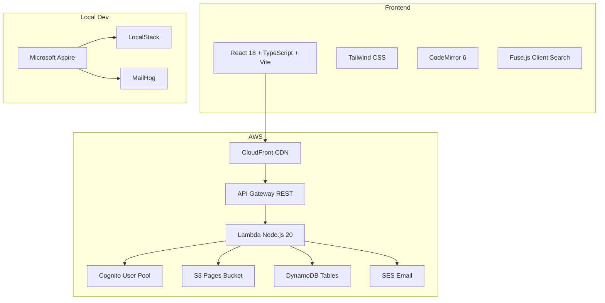

# BlueFinWiki Design

## Context

BlueFinWiki is a private family wiki for 3-20 members. It needs to be cheap (<$5/month), zero-ops, and reliable. The architecture must support a solo developer working with Claude as implementation partner — simplicity over sophistication at every decision point.

**The system is built on a plugin architecture.** Storage, search, and authentication are abstracted behind interfaces so the underlying technology can be swapped without affecting features or content. The current implementation uses AWS services (S3, Fuse.js, Cognito), but the wiki is not locked to AWS.

This design enables all flows: authentication, content editing, search, versioning, attachments, user management, and the features not yet built (comments, export, navigation, permissions).

## Constraints

- **Cost**: <$5/month total AWS bill for a family-sized wiki
- **Scale**: 3-20 users, <500 pages, <1000 attachments — not a platform
- **Ops**: Zero operational burden — no servers to maintain, no databases to tune
- **Team**: Solo developer + Claude — prefer managed services and simple abstractions
- **Local dev**: Must run entirely locally without AWS account for development

---

## Architecture Overview



### Frontend

React 18 with TypeScript, bundled by Vite, styled with Tailwind CSS. Served via CloudFront. Key libraries:
- **CodeMirror 6**: Markdown editor with syntax highlighting, toolbar, and split-pane preview
- **react-markdown**: Renders Markdown with remark-gfm, remark-breaks, rehype-highlight, Mermaid support, and custom image sizing (``, ``, `` via `remarkImageSize` plugin)
- **Fuse.js**: Client-side full-text search against a pre-built JSON index
- **React Router**: SPA routing
- **React Context**: Auth state (Cognito tokens, user info, role)

State management: React Context (auth), two hand-rolled module stores (`draftsStore.ts` for in-memory draft persistence, `layoutStore.ts` for panel preferences in localStorage), and `@tanstack/react-query` (installed, caching behaviour deferred for MVP).

### Backend

AWS Lambda functions (Node.js 20) behind API Gateway REST. Single handler pattern — one Lambda function with API Gateway routing, not individual Lambda functions per endpoint. Key patterns:
- **Individual Lambda functions**: One function per API endpoint (~14 for pages, 4 auth triggers, search index builder). Not a single-handler pattern.
- **Storage Plugin**: `IStoragePlugin` interface with `S3StoragePlugin` implementation. Abstraction allows future GitHub backend.
- **Search Provider**: `ISearchProvider` interface with client-side (Fuse.js index builder) default. Only `published` pages are indexed. Optional DynamoDB and S3 Vectors providers.
- **Auth Middleware**: JWT validation via `aws-jwt-verify` against Cognito ID tokens. Bearer tokens in Authorization header, stored in `localStorage`. Extracts user context (sub, email, role, displayName, status, preferences). `withRole()` helper exists but not applied to endpoints yet.
- **Cognito Triggers**: Pre-token-generation (add custom claims), post-confirmation (activate profile), custom-message (branded emails), forgot-password (rate limiting/logging)

### Infrastructure

AWS CDK with C# for infrastructure as code. Single unified stack (`UnifiedStack`) containing all resources:

| Resource Group | What's In It |
|----------------|-------------|
| Auth | Cognito UserPool, WebClient, NativeClient, IdentityPool, domain, 4 trigger Lambdas |
| Storage | S3 pages bucket (versioning enabled), S3 frontend bucket (no versioning) |
| Database | DynamoDB tables (user_profiles, invitations, page_links, activity_log, page_index) |
| Compute | Individual Lambda functions per endpoint (~14 pages + 4 auth + search), API Gateway REST API with Cognito authorizer |
| CDN | CloudFront distribution serving frontend bucket |

Three environments: dev, staging, production. API Gateway throttling: 50 req/s sustained, burst 100.

### Local Development

Microsoft Aspire (.NET 8) orchestrates all services with one command: `dotnet run --project aspire/BlueFinWiki.AppHost`

| Service | Local | Production |
|---------|-------|------------|
| Frontend | Vite dev server :5173 | CloudFront + S3 |
| Backend | Lambda local :3000 | API Gateway + Lambda |
| AWS Services | LocalStack | Real AWS |
| Email | MailHog :8025 | SES |
| Auth | cognito-local | AWS Cognito |
| Observability | Aspire Dashboard :15888 | CloudWatch |

---

## Data Model

### S3 Storage (Pages, Attachments)

Pages stored as Markdown files with YAML frontmatter:

```
bucket/
├── {guid}/{guid}.md                                          # Root page
├── {guid}/_attachments/                                      # Root page attachments
│   ├── {sanitized-filename}.png                              # Attachment file
│   └── {sanitized-filename}.png.meta.json                    # Sidecar metadata
├── {guid}/{child-guid}/{child-guid}.md                       # Child page
├── {guid}/{child-guid}/_attachments/                         # Child page attachments
├── {guid}/{child-guid}/{grandchild-guid}/{grandchild-guid}.md  # Grandchild
└── search-index.json                                         # Client search index
```

Every page lives inside its own GUID-named folder. The `_attachments/` directory is a sibling of the `.md` file, derived by stripping the filename from the page's S3 key.

Page file format:
```yaml
---
title: Page Title
guid: <page-guid>
parentGuid: <parent-guid or null>
folderId: <same as parentGuid — legacy/redundant field>
status: Draft | Published | Archived
sortOrder: <integer — position among siblings in page tree, lower first>
boardOrder: <integer — position within board column, lower first>
description: Optional description
tags: [tag1, tag2]
createdBy: <cognito-sub>
modifiedBy: <cognito-sub>
createdAt: <ISO timestamp>
modifiedAt: <ISO timestamp>
---

Markdown content here...
```

**Key decisions**:
- Pages ARE folders — a page with children has a directory named `{guid}/`
- GUIDs for all identifiers — titles stored in frontmatter, renames don't break paths
- S3 versioning for page history — no custom version management
- Sidecar `.meta.json` for attachment metadata — not a DynamoDB table
- Sort order — two independent integer fields in frontmatter: `sortOrder` controls sibling ordering in the page tree, `boardOrder` controls card position within board columns. Pages/cards without these fields sort after ordered ones. Tree reorder uses a batch endpoint; board reorder uses gap-based single-card updates via the page update endpoint.
- Hard delete — no trash/restore mechanism. Deleted pages are permanently removed from S3. Recoverability via S3 versioning only.
- Move is copy + delete — not atomic. If copy succeeds but delete fails, duplicates exist. No detection or cleanup mechanism yet.
- Page size — no enforced limit. Large pages may cause editor performance issues and Lambda timeout on export. Consider a warning at 50K characters.
- Image sizing — Obsidian-style `` syntax via custom remark plugin (`remarkImageSize`). Supports px and % dimensions.

### DynamoDB Tables

| Table | PK | SK/GSI | Purpose |
|-------|-----|--------|---------|
| `page_index` | `guid` | — | GUID-to-S3-key mapping — eliminates bucket scans in `findPageKey()`. Self-repairing: falls back to S3 scan and repairs the index on miss. |
| `user_profiles` | `cognitoUserId` | GSI: `email-index` | Extended profile data (role, preferences, display name) |
| `invitations` | `inviteCode` | TTL: `expiresAt` | Invitation codes with 7-day expiry |
| `page_links` | `sourceGuid` | SK: `targetGuid`, GSI: `targetGuid-index` | Wiki link tracking for backlinks |
| `tags` | `scope` | SK: `tag` | Scoped tag vocabulary — `scope` is the property name (e.g., `genre`) or `_page` for page-level tags. Each scope has its own autocomplete list. |
| `page_types` | `guid` | — | Page type definitions — name, icon, property schema (JSON), allowed child types (JSON), allowed parent types (JSON) |
| `user_preferences` | `userId` | SK: `preferenceKey` | **Not yet created** — theme, dashboard layout, favorites, tour completion |
| `activity_log` | `userId` | SK: `timestamp`, TTL: 90 days | Created in CDK. Post-confirmation trigger writes to it. No UI or query APIs yet. |
| `comments` | `guid` | GSI: `pageGuid-createdAt-index` | **Not yet created** — page comments |
| `site_config` | `configKey` | — | **Not yet created** — admin settings |

### Cognito

- User Pool with email as username
- Password policy: min 8 chars, uppercase, lowercase, numbers, symbols
- Token expiry: access 1 hour, refresh 30 days
- Custom attributes: `custom:role` (Admin/Standard)
- OAuth flows: authorization code + implicit
- SRP authentication

---

## Plugin Architecture

The wiki's core capabilities are abstracted behind interfaces. Each plugin implements a contract; the rest of the system codes against the interface, never the implementation.

### Storage Plugin (`StoragePlugin` interface)

Defines the contract for all page and attachment operations: save, load, delete, list, move, versions, attachments. Every feature that touches page content goes through this interface.

| Implementation | Status | What it provides |
|----------------|--------|-----------------|
| `S3StoragePlugin` | **Active** | AWS S3 with versioning, YAML frontmatter, pages-as-folders |
| GitHub plugin | Planned | Git-backed storage with PR-based versioning |

> `backend/src/storage/StoragePlugin.ts` — Interface definition
> `backend/src/storage/S3StoragePlugin.ts` — Current implementation
> `backend/src/storage/BaseStoragePlugin.ts` — Shared logic (validation, circular reference checks)

### Search Provider (`ISearchProvider` interface)

Defines the contract for indexing and searching pages: `indexPage()`, `search()`, `deletePage()`, `reindexAll()`, `getCapabilities()`.

| Implementation | Status | Cost | Trade-off |
|----------------|--------|------|-----------|
| Client-side (Fuse.js) | **Active** | $0/month | Good for <500 pages, no server cost |
| DynamoDB | Optional | <$1/month | Server-side, scan-based, better for larger wikis |
| S3 Vectors + Bedrock | Optional | <$0.15/month | Semantic search, natural language queries |

> `backend/src/search/SearchProvider.ts` — Interface definition
> `backend/src/search/SearchProviderRegistry.ts` — Plugin loader (reads `SEARCH_PROVIDER_TYPE` env var)

### Authentication (Isolated, not yet a formal plugin)

Authentication is isolated behind the auth middleware and Cognito-specific code in `backend/src/auth/`. The middleware extracts a `UserContext` (userId, email, role, displayName, status) from JWT claims — downstream code works with `UserContext`, not Cognito types.

Swapping auth providers would require: a new auth middleware that produces the same `UserContext`, replacement Lambda triggers (or equivalent), and frontend auth context changes. The interface is implicit (the `UserContext` shape) rather than a formal plugin contract.

**Future consideration**: Formalising an `IAuthProvider` interface would make auth provider swaps as clean as storage and search swaps.

---

## Cross-Cutting Concerns

### Authentication & Authorization

All API requests validated by Cognito authorizer on API Gateway. JWT claims provide `sub` (user ID), `email`, and `custom:role`. Auth middleware extracts these into request context for Lambda handlers.

**JWT transport**: Bearer tokens in Authorization header. Tokens stored in `localStorage` via the frontend AuthContext. This means CSRF protection is not required (no cookies), but XSS can steal tokens. Markdown output sanitization is critical — see Content Security section.

**Role changes and active sessions**: JWT tokens are stateless with 1-hour expiry. A role demotion does not take effect until the access token expires or is refreshed. The pre-token-generation trigger will issue a token with the new role on next refresh. This means a demoted admin retains privileges for up to 1 hour.

**Gap**: Permission enforcement beyond basic auth is not implemented. The two-role model exists in Cognito but no middleware enforces role-based access on endpoints. Draft visibility is not filtered.

### Content Security

**Markdown sanitization**: User-supplied Markdown is rendered to HTML via react-markdown. **Neither DOMPurify nor rehype-sanitize is in the pipeline.** Mermaid diagrams are rendered via `dangerouslySetInnerHTML` (partially mitigated by Mermaid `securityLevel: 'strict'`). Since JWT tokens are in `localStorage`, any XSS vulnerability can steal authentication tokens. Adding `rehype-sanitize` to the react-markdown plugin chain is a priority.

**Content Security Policy**: Not configured. No `ResponseHeadersPolicy` on CloudFront. For a wiki rendering user-generated HTML, a CSP header should restrict inline scripts, limit `connect-src` to the API Gateway domain, and set `frame-ancestors: none`.

**CSRF protection**: Not required — JWT is transported via Bearer tokens in the Authorization header, not cookies.

### Error Handling

Frontend: React error boundaries catch component crashes. Backend: Lambda handlers return structured error responses with status codes. No global retry/backoff strategy implemented. No offline mode.

**Gap**: Comprehensive error handling (Spec 19) is not built — conflict resolution UI, graceful degradation, rate limiting beyond search, monitoring/alerting.

### Attachment Binary Content

Binary files are NOT proxied through API Gateway. Instead, the API returns a presigned S3 URL in a JSON response, and the browser loads binary content directly from S3. This decision was forced by three failed attempts at API Gateway binary proxying (documented in `docs/attachment-download-architecture.md`).

If a future storage plugin cannot generate download URLs, the JSON-envelope approach can be revisited using the storage SDK directly instead of `fetch()`.

### Search Index Freshness

The search index is rebuilt on every page change (S3 event → Lambda). The index is a single JSON file served from S3/CloudFront. **No CloudFront cache invalidation** in MVP — stale results possible until CDN TTL expires. Frontend refreshes on visibility change.

### Caching

Minimal caching in MVP. Lambda containers are ephemeral with cold starts — no in-memory caching. `@tanstack/react-query` is installed but caching behaviour is not actively configured. Search index served with `Cache-Control: public, max-age=60`. S3 sub-10ms latency is sufficient for 3-20 users. Post-MVP: React Query with TTL, CloudFront API caching.

---

## Trade-offs

| Chose | Over | Why |
|-------|------|-----|
| S3 versioning | Custom version metadata | Simpler, no additional storage, S3 manages lifecycle |
| Pages-as-folders | Separate folder entity | One concept instead of two, hierarchy from paths |
| Client-side search | Server-side search | $0/month, sufficient for <500 pages, no infrastructure |
| Manual save | Autosave | Reduced complexity for MVP, autosave deferred |
| No caching | React Query + CloudFront caching | Acceptable latency at family scale, simpler debugging |
| Sidecar JSON | DynamoDB for attachment metadata | Metadata lives with the file, no cross-service consistency issue |
| URL redirect for downloads | API Gateway binary proxy | Three proxy approaches failed (see architecture doc) |
| CDK with C# | CDK with TypeScript | Type-safe infrastructure matching Aspire language choice |
| Aspire for local dev | Docker Compose | Integrated dashboard, service discovery, health checks |

## Alternatives Considered

| Alternative | Why Not |
|-------------|---------|
| **Amplify** for full stack | Too opinionated, harder to customize, vendor lock-in beyond what's needed |
| **DynamoDB for pages** | S3 is simpler for document storage, versioning is built-in, cheaper at low scale |
| **PostgreSQL (RDS)** | Operational overhead (patching, backups), cost ($15+/month minimum), overkill for 3-20 users |
| **GitHub as primary storage** | Good for version control but poor for dynamic features (search, attachments, real-time) |
| **Server-side search (OpenSearch)** | $20+/month, massive overkill for <500 pages |
| **Next.js / SSR** | Unnecessary for SPA with small user count, adds server complexity |

## Risks and Mitigations

| Risk | Impact | Mitigation |
|------|--------|------------|
| `findPageKey` scans entire S3 bucket | Every non-root page load is O(n) | **Mitigated**: Page Index implemented — DynamoDB GUID-to-path lookup with S3 scan fallback and self-repair |
| Lambda cold starts | First request slow | Provisioned concurrency for critical functions (post-MVP) |
| Search index grows too large | Frontend load time increases | At 500 pages ~2MB JSON. Acceptable. Compress or paginate if needed |
| CDK synth workflow disabled | No automated infrastructure validation on PR | Re-enable `infrastructure.yml` workflow |
| Stale TECHNICAL-PLAN.md | Agents may create wrong DynamoDB tables | Do not use TECHNICAL-PLAN.md for new work. ODAD docs are source of truth |
| No conflict resolution | Concurrent edits overwrite silently | Low risk at 3-20 users. Build conflict UI in Phase 4 |

---

## Extension Points

| Point | Interface | Current | Future |
|-------|-----------|---------|--------|
| Storage | `StoragePlugin` (formal) | S3StoragePlugin | GitHub storage plugin |
| Search | `ISearchProvider` (formal) | Client-side Fuse.js ($0) | DynamoDB ($<1), S3 Vectors ($<0.15) |
| Auth | `UserContext` shape (implicit) | Cognito + JWT | Formal `IAuthProvider` interface, other IdPs |
| Export | Not defined | Not built | Puppeteer Lambda for PDF, static HTML bundler |
| Notifications | Not defined | Email only (invitations, password reset) | In-app notifications, @mentions (post-MVP) |

---

*Build the simplest thing that works. Add complexity only when the simple thing stops working.*
