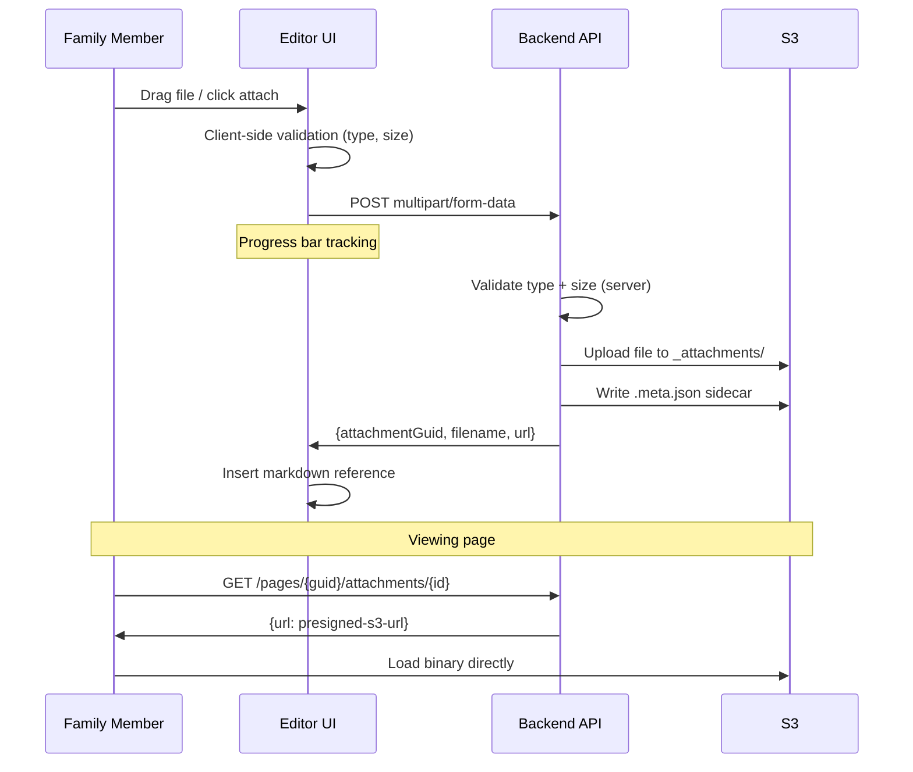

# Attachment Flow

How files are attached to pages — from upload through storage to display and download.

## Trigger

A family member drags a file into the editor, clicks the attachment button, or uses the file picker.

---

## Stages

### 1. File Selection
**Actor**: Family member
**Action**: Drag-and-drop onto editor, click attachment toolbar button, or use file picker. Multi-file supported.
**Output**: Files queued for upload with client-side validation
**Failure**: File too large (>10MB image, >50MB document), unsupported type — error shown before upload attempt

### 2. Upload
**Actor**: Frontend
**Action**: POST multipart/form-data to `/pages/{pageGuid}/attachments` per file. XMLHttpRequest tracks progress.
**Output**: Progress bar per file, streaming upload to Lambda
**Failure**: Network failure (show per-file error, other files continue), server validation rejection

### 3. Server Processing
**Actor**: `pages-attachments` Lambda
**Action**: Parses multipart body. Validates file type (whitelist: images, PDFs, docs) and size. Generates attachment GUID. Uploads to S3 at `{pageGuid}/{pageGuid}/_attachments/{attachmentGuid}.{ext}`. Creates sidecar `.meta.json` with metadata (attachmentId, originalFilename, contentType, size, uploadedAt, uploadedBy, dimensions if image, checksum).
**Output**: AttachmentGuid, filename, size, download URL returned to frontend
**Failure**: S3 write failure (return 500), metadata write failure (orphaned attachment — needs cleanup)

### 4. Editor Integration
**Actor**: Frontend
**Action**: On successful upload, inserts Markdown syntax into editor: `` for images, `[filename](attachment-url)` for documents. Attachment appears in attachment panel below editor.
**Output**: Inline reference in page content, attachment listed in panel
**Failure**: None significant — insertion is local editor operation

### 5. Display & Download
**Actor**: Family member (viewing page)
**Action**: Images render inline via presigned S3 URL. Attachment list shows all files with type icon, name, size, date. Click to download.
**Output**: Binary content loaded directly from S3 (not proxied through API Gateway)
**Failure**: Presigned URL expired (re-fetch URL from API), S3 object deleted (show "Attachment not found")

**Key architectural decision**: Downloads use URL redirect, not binary proxying. The API returns a JSON response with a presigned S3 URL. The browser loads the binary directly from S3. This avoids API Gateway binary content issues (see `docs/attachment-download-architecture.md`).

### 6. Deletion
**Actor**: Family member (author or admin)
**Action**: Clicks delete on attachment, confirms in dialog
**Output**: DELETE `/pages/{pageGuid}/attachments/{attachmentGuid}` removes both S3 file and `.meta.json`
**Failure**: Permission denied (not author or admin), S3 delete failure

---

## Flow Diagram

## Error Handling

| Error | Behaviour |
|-------|-----------|
| File too large | Client-side rejection before upload. "Images must be under 10MB, documents under 50MB" |
| Unsupported type | Client-side + server-side rejection. "File type not supported" |
| Upload network failure | Per-file error with retry option. Other files unaffected |
| Presigned URL expired | Re-fetch URL from API, transparent to user |
| Orphaned attachment (metadata write failed) | Attachment exists in S3 without metadata — not listed but occupies storage |

## Verification

| Environment | How |
|-------------|-----|
| **Local** | Aspire + LocalStack S3. Upload various file types, verify S3 paths, download via presigned URLs |
| **Automated tests** | Unit: multipart parsing, validation. Integration: full upload → metadata → list → download → delete lifecycle |
| **Production** | S3 storage metrics. Attachment count per page. Orphaned file detection |

## Related

- North star: Content Creation declarations (attach files by dragging)
- Flow: content-editing.md (attachment upload during editing)
- Design: Storage architecture, attachment download architecture
- Findings: Attachment download architecture decision
