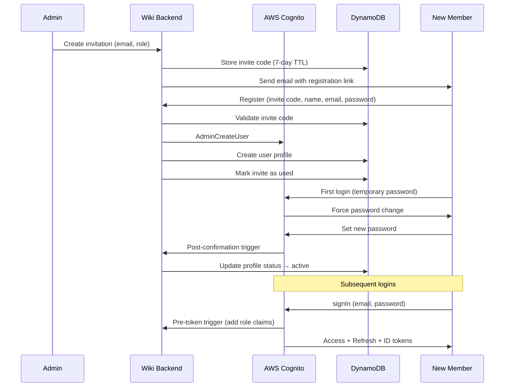

# Authentication Flow

How family members join the wiki and maintain authenticated sessions — from admin invitation through login to session refresh.

## Why This Matters

| Without | With |
|---------|------|
| Anyone can access the family wiki | Only invited family members can join |
| No identity, no attribution | Every edit and comment attributed to a person |
| No role-based controls | Admins manage membership, standards contribute |

## Trigger

An admin decides to invite a new family member, or an existing member opens the wiki.

---

## Flow 1: Invitation & Registration

### 1. Admin Creates Invitation
**Actor**: Admin (family member with admin role)
**Action**: Generates an invitation with optional pre-assigned email and role
**Output**: 8-character alphanumeric invite code stored in DynamoDB `invitations` table with 7-day TTL
**Failure**: Code collision (regenerate), DynamoDB write failure (retry)

### 2. Invitation Delivery
**Actor**: System (SES or MailHog locally)
**Action**: Sends email with registration link containing invite code
**Output**: Email with link: `https://wiki.example.com/register?invite={code}`
**Failure**: Email delivery failure (admin can copy link manually)

### 3. New Member Registers
**Actor**: Invited family member
**Action**: Opens registration link, enters name, email, password
**Output**: Frontend validates input, sends to `auth-register` Lambda
**Failure**: Invalid/expired/used invite code (clear error message)

### 4. User Creation
**Actor**: `auth-register` Lambda
**Action**: Validates invite code against DynamoDB → calls Cognito AdminCreateUser → creates DynamoDB user profile → marks invite as used
**Output**: Cognito user with temporary password, DynamoDB profile with role
**Failure**: Cognito error (return specific error), DynamoDB profile creation fails (user exists in Cognito but not DynamoDB — needs reconciliation)

### 5. First Login
**Actor**: New family member
**Action**: Logs in with temporary password, Cognito forces password change
**Output**: New password set, `auth-post-confirmation` trigger updates profile status to active
**Failure**: Password doesn't meet policy (Cognito returns specific requirements)

---

## Flow 2: Login

### 1. Member Enters Credentials
**Actor**: Family member
**Action**: Enters email and password on login page
**Output**: Frontend calls Cognito signIn API (SRP authentication)
**Failure**: Invalid credentials (NotAuthorizedException), account disabled (UserNotConfirmedException)

### 2. Cognito Issues Tokens
**Actor**: AWS Cognito
**Action**: Validates credentials, invokes pre-token-generation trigger to add custom claims (role, preferences from DynamoDB)
**Output**: Access token (1 hour), refresh token (30 days), ID token
**Failure**: Pre-token trigger fails (Cognito returns generic error, user cannot log in)

### 3. Session Established
**Actor**: Frontend AuthContext
**Action**: Stores tokens, sets user state (userId, email, role), starts token refresh listener
**Output**: Authenticated session, protected routes accessible
**Failure**: Token storage fails (localStorage unavailable — degrade gracefully)

---

## Flow 3: Password Reset

### 1. Member Requests Reset
**Actor**: Family member
**Action**: Clicks "Forgot password", enters email
**Output**: Cognito sends verification code email (6-digit, 1-hour expiry)
**Failure**: Email not found (Cognito returns same response for security — no user enumeration)

### 2. Member Submits New Password
**Actor**: Family member
**Action**: Enters verification code and new password
**Output**: Password updated in Cognito, old sessions invalidated
**Failure**: Invalid/expired code, password doesn't meet policy

---

## Flow 4: Session Refresh

### 1. Access Token Expires
**Actor**: Cognito SDK (automatic)
**Action**: Detects expired access token, uses refresh token to get new access token
**Output**: New access token, session continues seamlessly
**Failure**: Refresh token also expired (redirect to login)

---

## Flow Diagram

## Error Handling

| Error | Behaviour |
|-------|-----------|
| Expired invite code | "This invitation has expired. Ask an admin for a new one." |
| Used invite code | "This invitation has already been used." |
| Cognito rate limit | Exponential backoff, show "Please try again shortly" |
| Network failure during registration | User may exist in Cognito but not DynamoDB — registration retry should handle idempotently |

## Verification

| Environment | How |
|-------------|-----|
| **Local** | Aspire with cognito-local Docker container + MailHog for email. Registration link appears in MailHog at localhost:8025 |
| **Automated tests** | Backend unit tests mock Cognito SDK. Integration tests against LocalStack |
| **Production** | CloudWatch logs for auth Lambda invocations. Cognito console for user pool metrics |

## Related

- North star: Access & Identity declarations
- Design: Authentication architecture section
- Spec 1 (archived): Original speckit auth specification
