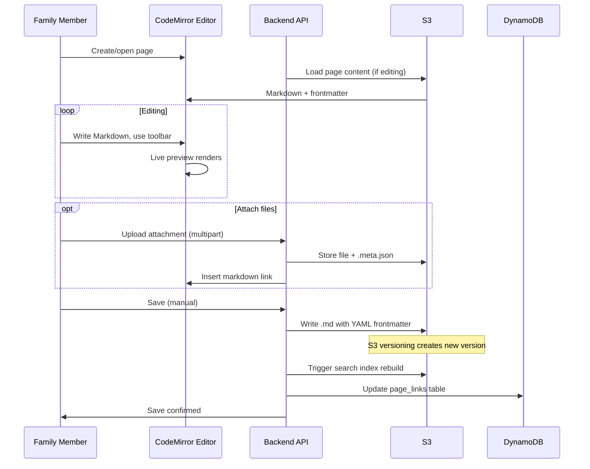

# Content Editing Flow

How family members create and edit pages — from opening the editor through writing content to saving and creating versions.

## Trigger

A family member clicks "New Page" or opens an existing page for editing.

---

## Stages

### 1. Page Creation
**Actor**: Family member
**Action**: Clicks "New Page", enters title, optionally selects parent page
**Output**: New page GUID generated, blank editor opens
**Failure**: Parent page doesn't exist (validation error), title empty (client validation)

### 2. Content Authoring
**Actor**: Family member
**Action**: Writes in CodeMirror editor using Markdown. Uses toolbar for formatting (bold, italic, headers, lists, links, images, code). Sees live preview in split pane.
**Output**: Markdown content in editor state, dirty flag set
**Failure**: Browser crash loses unsaved content (no autosave in MVP — content lost)

### 3. Metadata Editing
**Actor**: Family member
**Action**: Sets page properties in metadata panel: title, tags, status (Draft/Published/Archived), description
**Output**: Metadata fields updated in editor state
**Failure**: None significant — metadata is optional

### 4. Attachment Upload
**Actor**: Family member
**Action**: Drags file into editor or clicks attachment button. File uploaded via multipart POST to `/pages/{guid}/attachments`
**Output**: File stored in S3 at `{pageGuid}/{pageGuid}/_attachments/{attachmentGuid}.{ext}`. Sidecar `.meta.json` created. Markdown image/link syntax inserted into editor.
**Failure**: File too large (>10MB image, >50MB document), unsupported type (client-side + server-side validation), upload network failure (progress bar shows error)

### 5. Manual Save
**Actor**: Family member
**Action**: Clicks Save button
**Output**: Page content + metadata sent to `pages-update` (PUT /pages/{guid}) or `pages-create` (POST /pages) for new pages. Storage plugin writes markdown file with YAML frontmatter to S3. S3 versioning creates new version automatically. Search index rebuild triggered by S3 event.
**Failure**: 409 conflict (someone else edited — show conflict warning), network error (show save failed, content preserved in editor)

### 6. Wiki Link Processing
**Actor**: System (on save)
**Action**: Parses saved content for `[[wiki links]]`. Extracts all links, updates DynamoDB `page_links` table (insert new, remove stale).
**Output**: Backlinks updated for all referenced pages
**Failure**: Link resolution fails for ambiguous titles (stored as broken link, displayed with `?` indicator)

---

## Flow Diagram

## Error Handling

| Error | Behaviour |
|-------|-----------|
| Network failure on save | Show error, content preserved in editor, user can retry |
| 409 conflict (concurrent edit) | Show warning — currently no merge UI (MVP) |
| Attachment upload fails | Show error per file, other uploads continue |
| S3 write failure | Lambda retries, return 500 to frontend |

## Verification

| Environment | How |
|-------------|-----|
| **Local** | Aspire with LocalStack S3. Create page, edit, save, verify S3 object created with correct path and frontmatter |
| **Automated tests** | Backend: mock S3 for unit tests, LocalStack for integration. Frontend: component tests for editor state |
| **Production** | S3 object count and versioning. Search index freshness. Lambda error rate |

## Related

- North star: Content Creation declarations
- Flow: attachments.md (detailed attachment lifecycle)
- Flow: search-discovery.md (search index rebuild on save)
