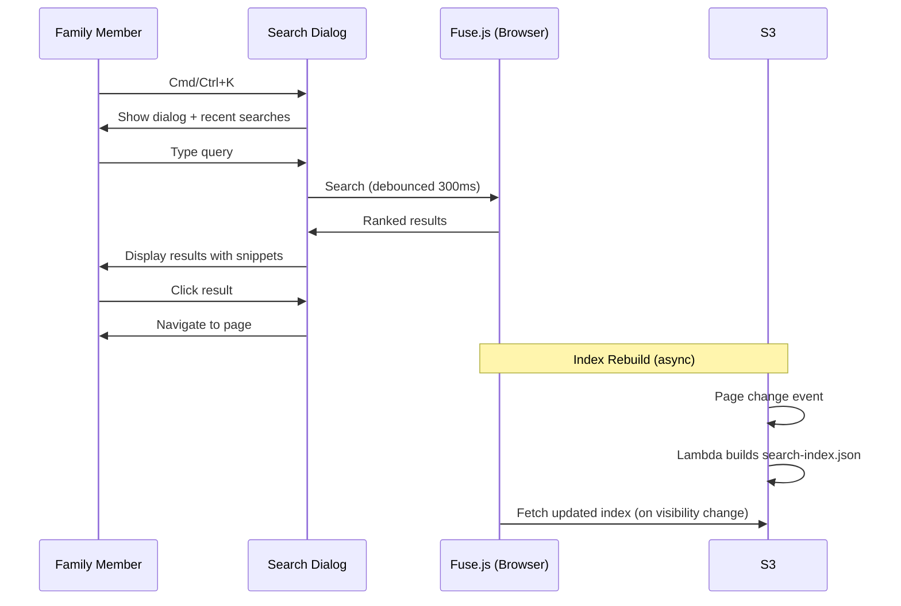

# Search & Discovery Flow

How family members find content — from typing a query through the search index to navigating results.

## Trigger

A family member presses Cmd/Ctrl+K or clicks the search icon.

---

## Flow 1: Search Query

### 1. Search Dialog Opens
**Actor**: Family member
**Action**: Keyboard shortcut (Cmd/Ctrl+K) or click opens modal search dialog with focus trap
**Output**: Search input focused. If empty, recent searches shown from localStorage (last 10, max 30 days old)
**Failure**: None

### 2. Query Input
**Actor**: Family member
**Action**: Types search query. Input debounced at 300ms. Optional: toggle title-only, select scope (All / Current folder / Current folder + subfolders)
**Output**: Debounced query string with filters
**Failure**: Query too long (max 500 chars, truncated)

### 3. Client-Side Search Execution
**Actor**: Frontend (Fuse.js)
**Action**: Fuse.js searches in-memory index. Weights: title 10x, tags 5x, content 1x. Fuzzy threshold 0.3, minimum 2 characters. Results filtered by scope if set.
**Output**: Ranked result set with relevance scores
**Failure**: Index not loaded (show "Search unavailable, loading index...")

### 4. Results Display
**Actor**: Frontend
**Action**: Display results with page title, snippet (200-300 chars around first match), folder path, highlighted matching terms. Keyboard navigation (up/down arrows, Enter to open). Paginated: 10 initially, "Load more" or user-selectable page size (10, 25, 50).
**Output**: Clickable result list
**Failure**: No results (show "No results found for '{query}'")

### 5. Navigation
**Actor**: Family member
**Action**: Clicks result or presses Enter on selected result. Ctrl+Enter opens in new tab.
**Output**: Navigate to `/pages/{pageId}`, dialog closes
**Failure**: Page deleted since index built (show "Page not found")

### 6. Search History
**Actor**: System
**Action**: Stores query in localStorage (`bluefin_recent_searches`). Max 10 entries, auto-cleanup at 30 days.
**Output**: Query available for future quick access
**Failure**: localStorage unavailable (skip silently)

---

## Flow 2: Search Index Rebuild

### 1. Page Change Event
**Actor**: S3 event notification
**Action**: Page created, updated, or deleted triggers S3 event
**Output**: `search-build-index` Lambda invoked
**Failure**: Event lost (index becomes stale until next change)

### 2. Index Construction
**Actor**: `search-build-index` Lambda
**Action**: Fetches all pages from storage plugin. Strips markdown formatting from content. Builds `ClientSearchIndex` JSON with fields: id, shortCode, title, content, tags, path, modifiedDate, author. Includes version number for cache invalidation.
**Output**: `search-index.json` uploaded to S3 static assets
**Failure**: Lambda timeout on large wikis (need pagination or streaming for >500 pages)

### 3. Frontend Index Refresh
**Actor**: Frontend
**Action**: Refreshes index on page visibility change or periodic poll. Checks version number against cached version.
**Output**: Updated Fuse.js instance with fresh data
**Failure**: Stale CDN cache (no CloudFront invalidation in MVP — TTL-based refresh only)

---

## Flow Diagram

## Error Handling

| Error | Behaviour |
|-------|-----------|
| Index not loaded | "Search loading..." with spinner, retry fetch |
| Empty index | "No pages indexed yet" |
| Stale index (page deleted) | "Page not found" on navigation, index refreshes |
| Rate limit | Client-side: 60 searches/minute, debounce at 300ms |

## Verification

| Environment | How |
|-------------|-----|
| **Local** | Create pages, verify search-index.json built in LocalStack S3. Search for content, verify results |
| **Automated tests** | Unit: Fuse.js config with known data. Integration: full index build + search cycle |
| **Production** | Index freshness (compare version in S3 vs frontend). Search result accuracy spot checks |

## Related

- North star: Linking & Discovery declarations
- Flow: content-editing.md (save triggers index rebuild)
- Design: Search architecture, pluggable provider interface
