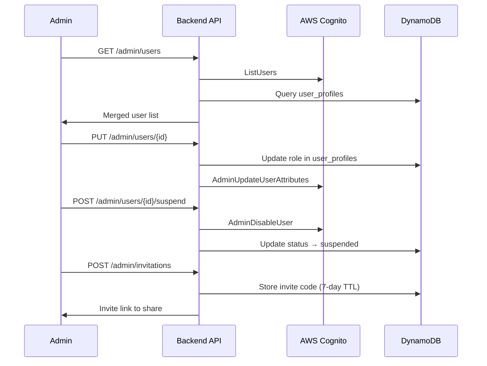

# User Management Flow

How admins manage family membership — viewing members, changing roles, suspending accounts, and tracking activity. **Not yet built.**

## Trigger

An admin opens the user management section of the admin dashboard.

---

## Flow 1: View & Manage Members

### 1. Admin Opens User List
**Actor**: Admin
**Action**: Navigates to admin user management page
**Output**: API call to `admin-users-list` (GET /admin/users)
**Failure**: Not an admin (403 Forbidden)

### 2. User List Retrieved
**Actor**: `admin-users-list` Lambda
**Action**: Calls Cognito ListUsers API for auth data (email, status, last login). Queries DynamoDB `user_profiles` for extended data (role, display name, preferences). Merges both sources.
**Output**: Paginated user list with columns: Name, Email, Role, Status, Last Active
**Failure**: Cognito API pagination token expired (restart from beginning)

### 3. View User Detail
**Actor**: Admin
**Action**: Clicks on a user row
**Output**: Modal with full profile, activity summary (recent pages edited), and action buttons
**Failure**: User deleted between list and detail fetch (show "User not found")

### 4. Edit User
**Actor**: Admin
**Action**: Changes role (Admin/Standard), updates email, or triggers password reset
**Output**: Role updated in DynamoDB + Cognito custom attributes. Email change triggers Cognito verification. Password reset via AdminSetUserPassword.
**Failure**: Cannot demote self (safety check), email already in use, Cognito update failure

### 5. Suspend / Activate
**Actor**: Admin
**Action**: Toggles user suspension
**Output**: Suspend: Cognito AdminDisableUser + DynamoDB status → suspended + notification email. Activate: Cognito AdminEnableUser + DynamoDB status → active + notification email.
**Failure**: Cannot suspend self, SES email delivery failure (action succeeds, notification fails)

### 6. Delete User
**Actor**: Admin
**Action**: Deletes a user (requires confirmation)
**Output**: DynamoDB soft delete (anonymize data, mark as deleted). Cognito hard delete (AdminDeleteUser). Owned pages reassigned to admin or archived. Activity logs preserved for audit.
**Failure**: Cannot delete self, page reassignment fails

---

## Flow 2: Invitation Management

### 1. Create Invitation
**Actor**: Admin
**Action**: Clicks "Invite Member", optionally enters email and role
**Output**: 8-char invite code generated, stored in DynamoDB with 7-day TTL. Email sent with registration link.
**Failure**: SES failure (admin can copy link manually), DynamoDB write failure

### 2. View Invitations
**Actor**: Admin
**Action**: Opens invitation management page
**Output**: List of all invitations with status (pending, used, expired, revoked), expiry date, and usage info
**Failure**: None significant

### 3. Revoke Invitation
**Actor**: Admin
**Action**: Clicks revoke on a pending invitation
**Output**: Invitation marked as revoked in DynamoDB, future use prevented
**Failure**: Already used (show status, cannot revoke)

---

## Flow 3: Activity Monitoring (Not Yet Built)

### 1. Activity Logging
**Actor**: System (on every significant action)
**Action**: Writes to DynamoDB `activity_log` table. Logs: page creates/edits/deletes, logins/logouts, admin actions (role changes, suspensions). Retention: 90 days via DynamoDB TTL.
**Output**: Audit trail per user
**Failure**: DynamoDB write failure (action succeeds, log lost — acceptable trade-off)

### 2. Activity Viewer
**Actor**: Admin
**Action**: Views activity log filtered by user, action type, date range
**Output**: Chronological activity list with user names (joined from user_profiles). Export to CSV option.
**Failure**: Large date ranges may be slow (paginate)

---

## Flow Diagram

## Error Handling

| Error | Behaviour |
|-------|-----------|
| Non-admin access | 403 Forbidden, redirect to home |
| Self-modification of role | "Cannot change your own role" |
| Self-suspension | "Cannot suspend your own account" |
| Cognito rate limit | Exponential backoff, show "Please try again" |

## Related

- North star: Access & Identity declarations
- Flow: authentication.md (invitation → registration)
- Design: User management architecture
