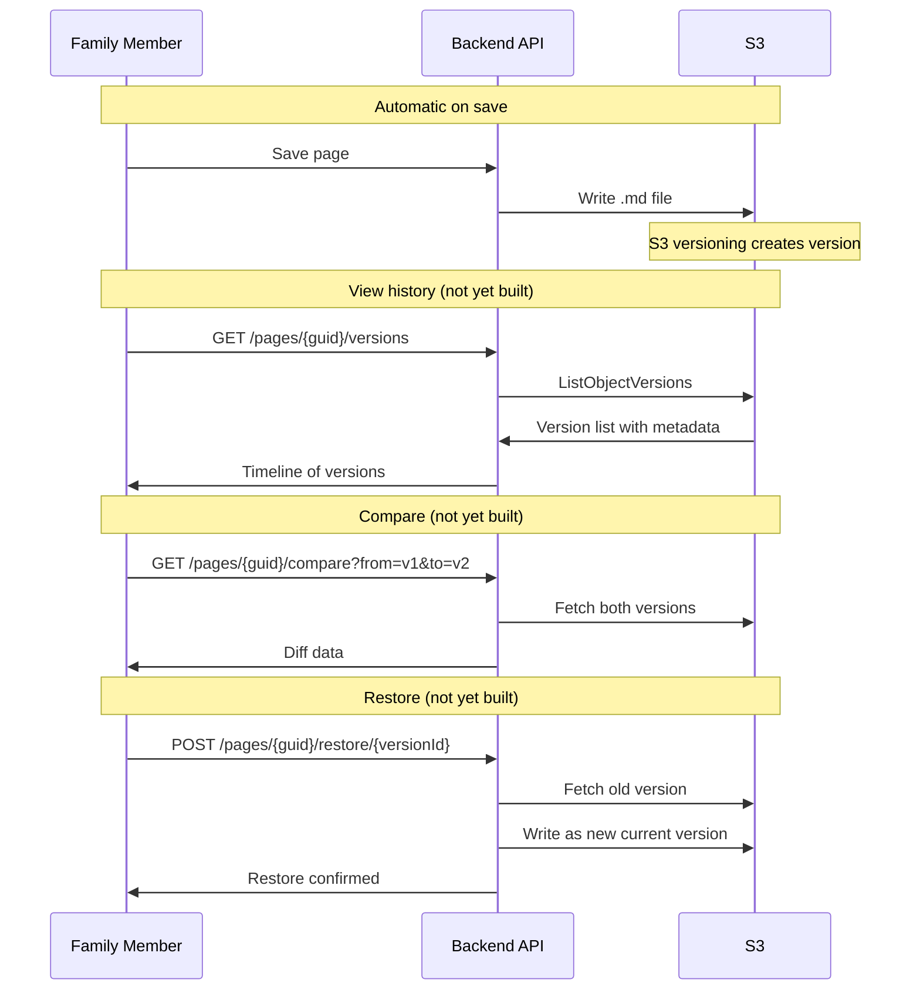

# Page Versioning Flow

How page history works — from automatic version creation on save through viewing history, comparing versions, and restoring previous content.

## Why This Matters

| Without | With |
|---------|------|
| Accidental overwrites are permanent | Every version recoverable |
| No audit trail of who changed what | Full attribution history |
| Fear of editing | Confidence to edit knowing nothing is lost |

## Trigger

A family member saves a page (version created automatically) or opens the history view.

---

## Flow 1: Version Creation (Automatic)

### 1. Page Saved
**Actor**: Family member (via Save button)
**Action**: Content + metadata sent to `pages-update` Lambda
**Output**: Storage plugin writes to S3. S3 bucket versioning automatically creates a new version object.
**Failure**: S3 write failure (Lambda retries, return error to frontend)

### 2. Version Metadata
**Actor**: Storage plugin
**Action**: YAML frontmatter includes `modifiedBy` (from JWT sub claim) and `modifiedAt` timestamp. S3 assigns a `versionId` to the object.
**Output**: Version is identifiable by S3 versionId, attributable to a user, timestamped
**Failure**: JWT missing user info (use "Unknown" — should not happen with auth middleware)

---

## Flow 2: View History (Not Yet Built)

### 1. Member Opens History
**Actor**: Family member
**Action**: Clicks "History" button on page
**Output**: API call to `pages-versions-list` (GET /pages/{guid}/versions)
**Failure**: API not implemented yet

### 2. Version List Retrieved
**Actor**: `pages-versions-list` Lambda
**Action**: Calls S3 ListObjectVersions for the page's .md file. For each version, loads frontmatter to extract author, timestamp, title.
**Output**: Chronological list (newest first) with version metadata
**Failure**: Too many versions (paginate, lifecycle policy retains 50)

### 3. History Display
**Actor**: Frontend
**Action**: Renders vertical timeline with version nodes showing timestamp, author, and change summary
**Output**: Interactive timeline with "View" and "Restore" buttons per version
**Failure**: None significant

---

## Flow 3: Compare Versions (Not Yet Built)

### 1. Member Selects Two Versions
**Actor**: Family member
**Action**: Selects "from" and "to" versions in history timeline
**Output**: API call to `pages-versions-compare` (GET /pages/{guid}/compare?from={v1}&to={v2})

### 2. Diff Computed
**Actor**: `pages-versions-compare` Lambda
**Action**: Fetches both version contents from S3. Generates line-by-line or word-by-word diff.
**Output**: Diff data with additions, deletions, unchanged sections
**Failure**: Version not found (deleted by lifecycle policy), diff too large (>10,000 lines — truncate with warning)

### 3. Diff Display
**Actor**: Frontend
**Action**: Renders side-by-side or inline diff view with color coding (green additions, red deletions), syntax highlighting, line numbers
**Output**: Visual diff the member can review
**Failure**: None significant

---

## Flow 4: Restore Version (Not Yet Built)

### 1. Member Requests Restore
**Actor**: Family member
**Action**: Clicks "Restore This Version" on a historical version
**Output**: Confirmation dialog: "Restore to version from [date] by [author]?"

### 2. Version Restored
**Actor**: `pages-versions-restore` Lambda
**Action**: Fetches historical version content from S3. Creates a new current version with that content. Adds metadata note: "Restored from version {versionId}".
**Output**: New version created (restore is non-destructive — adds to history, doesn't delete intermediate versions)
**Failure**: Source version deleted, concurrent edit during restore

---

## Flow Diagram

## Error Handling

| Error | Behaviour |
|-------|-----------|
| Version not found | "This version is no longer available" (lifecycle policy may have removed it) |
| Concurrent edit during restore | Restore creates new version — concurrent editor's next save will trigger 409 conflict |
| Diff too large | Truncate with "Showing first 10,000 lines. Full diff too large to display." |

## Verification

| Environment | How |
|-------------|-----|
| **Local** | Create page, edit multiple times, verify S3 object versions via LocalStack. List versions API returns correct history |
| **Automated tests** | Unit: version list parsing, diff generation. Integration: full create → edit → list → compare → restore cycle |
| **Production** | S3 version count per object. Lifecycle policy enforcement |

## Related

- North star: Versioning & History declarations
- Flow: content-editing.md (save creates versions)
- Design: Storage architecture, S3 versioning strategy
